# ResolveAI — Enterprise AI Support Agent

**Portfolio project · Full-stack multi-tenant AI support platform**

A production-deployed B2B support agent for e-commerce operations. It grounds answers in tenant policy (RAG), calls enterprise systems through typed tools, requires human approval before mutations, executes writes idempotently, and records a full audit trail.

> **For reviewers:** Start with [System overview](#system-overview) and [LangGraph agent workflow](#langgraph-agent-workflow), then [Project scope](#project-scope).

---

## At a glance

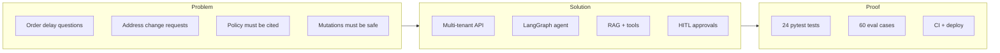

| | |
| --- | --- |
| **Problem** | Explain order issues with evidence; change addresses safely — no hallucinated policy, no double mutations. |
| **Approach** | FastAPI monolith + LangGraph + Next.js console, multi-tenant from day one. |
| **Domain** | Fictional e-commerce (delays, address changes, escalations). |
| **Hosting** | Vercel · FastAPI Cloud · Neon · Qdrant · Groq |
| **Docs** | Architecture · 11 ADRs · threat model · runbooks |

---

## System overview

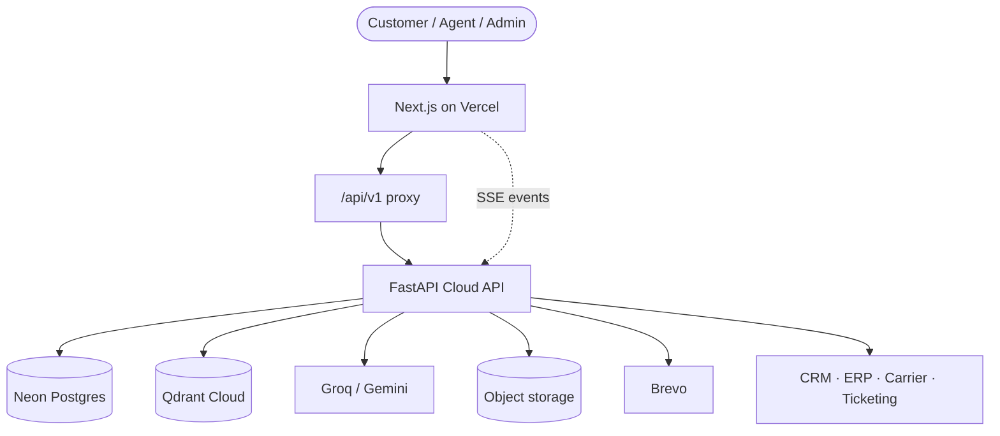

---

## Monorepo map

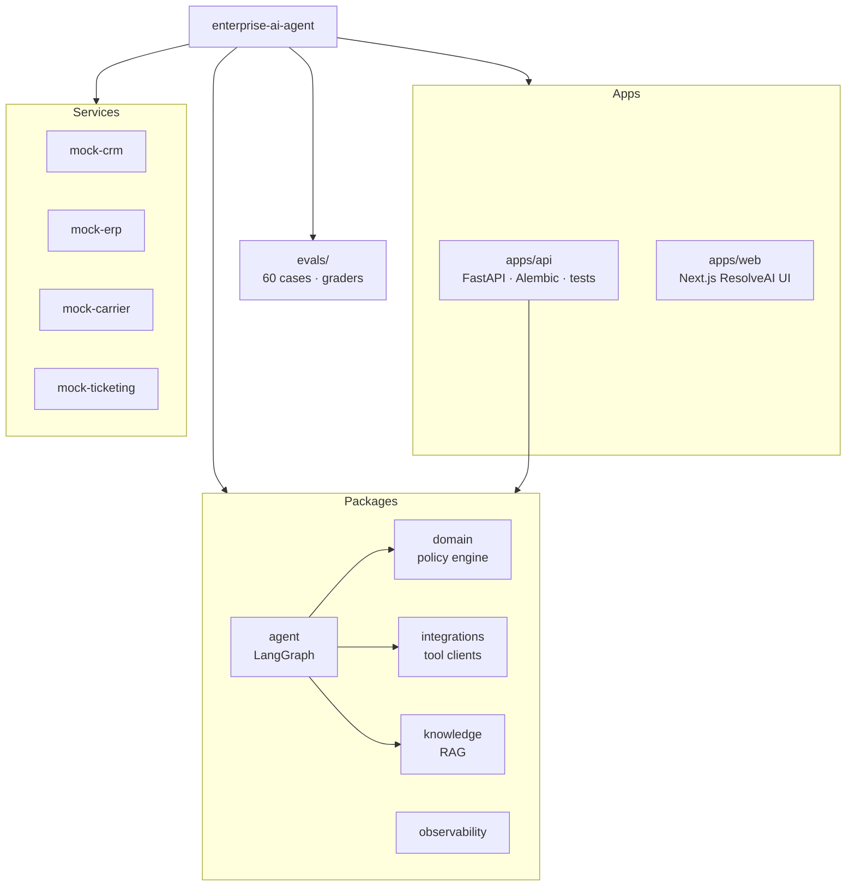

---

## LangGraph agent workflow

13-node graph (`packages/agent`, `graph_version=v1`):

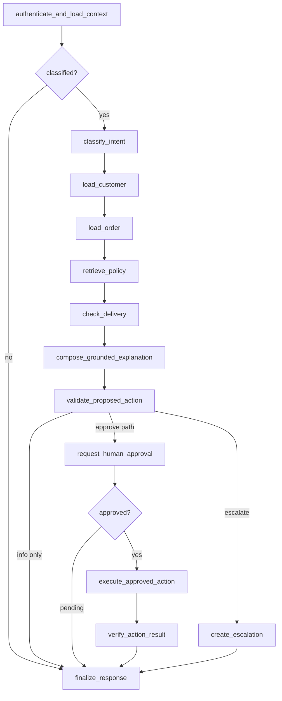

---

## Human-in-the-loop approval

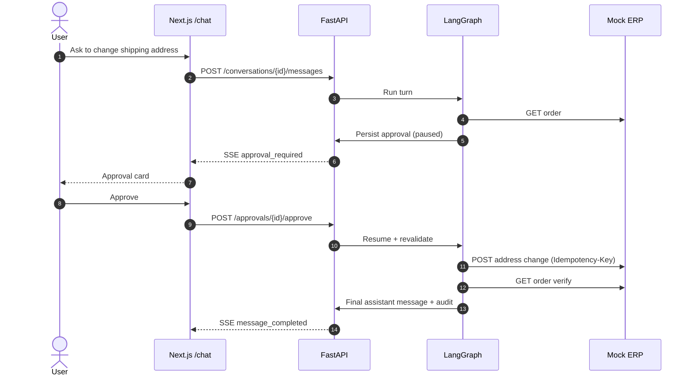

---

## RAG ingestion pipeline

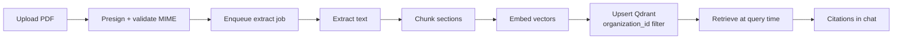

---

## Multi-tenancy & roles

```mermaid
flowchart TB
  subgraph Tenant A
    OA[Organization A]
    UA1[Admin]
    UA2[Agent]
    UA3[Customer]
    DA[Data + RAG index A]
  end

  subgraph Tenant B
    OB[Organization B]
    UB1[Admin]
    UB2[Customer]
    DB[Data + RAG index B]
  end

  JWT[JWT carries org_id from membership]
  JWT --> Tenant A
  JWT --> Tenant B

  UA3 -->|cannot read| DB
  UB2 -->|cannot read| DA
```

| Role | Chat | Inbox | Knowledge | Evals | Ops | Invite |
| --- | :---: | :---: | :---: | :---: | :---: | :---: |
| Customer | ✓ | | | | | |
| Agent | ✓ | ✓ | ✓ | | | |
| Supervisor | ✓ | ✓ | ✓ | ✓ | | |
| Admin | ✓ | ✓ | ✓ | ✓ | ✓ | ✓ |

---

## User journeys

### Real signup → first conversation

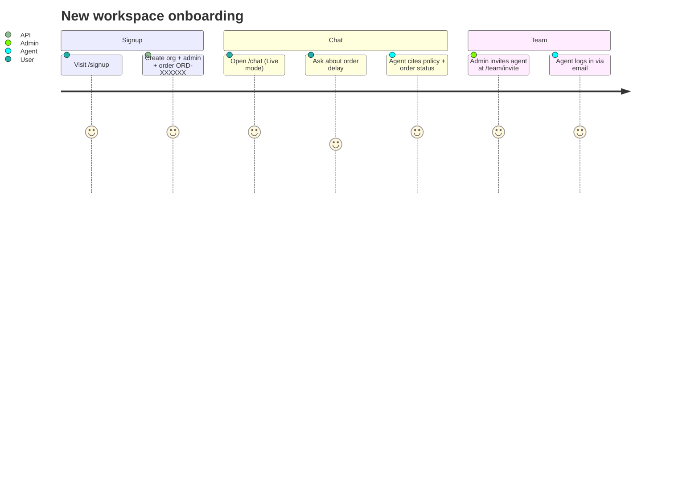

### Local demo (dev only)

| Role | Email | Org |
| --- | --- | --- |
| Customer | `customer@acme-demo.test` | Acme Retail |
| Agent | `agent@acme-demo.test` | Acme Retail |
| Admin | `admin@acme-demo.test` | Acme Retail |

Demo order: `ACM-10001` · set `DEV_AUTH_ENABLED=true`

---

## Project scope

I designed and built this end to end as a **portfolio-grade enterprise AI application**, not a thin chat wrapper.

| Layer | What I shipped |
| --- | --- |
| **Backend** | Multi-tenant Postgres, JWT auth, signup/login/invites, quotas, idempotency, job queue, audit log |
| **Agent** | LangGraph 13-node workflow, tool gateway, SSE streaming, Groq/Gemini providers |
| **RAG** | Upload pipeline, Qdrant with tenant filters, inline citations |
| **Frontend** | ResolveAI console — 12 routes, role nav, approval cards, run inspector |
| **Quality** | 24 pytest tests, 60-case eval suite, gitleaks, CI on every PR |
| **Ops** | GitHub Actions deploy to Vercel + FastAPI Cloud, Alembic migrations |
| **Docs** | Architecture, ADRs, threat model, runbooks, deployment guide |

### Frontend routes

| Route | Access | Purpose |
| --- | --- | --- |
| `/signup`, `/login` | Public | Workspace registration |
| `/chat` | All | Streaming chat + approvals |
| `/inbox` | Agent+ | Escalations |
| `/knowledge` | Agent+ | Document upload |
| `/evaluations` | Supervisor+ | Eval dashboard |
| `/operations` | Admin | Job queue health |
| `/team/invite` | Admin | Team invites |
| `/runs/[id]` | All | Agent run inspector |
| `/architecture` | All | In-app diagram |

---

## CI/CD pipeline

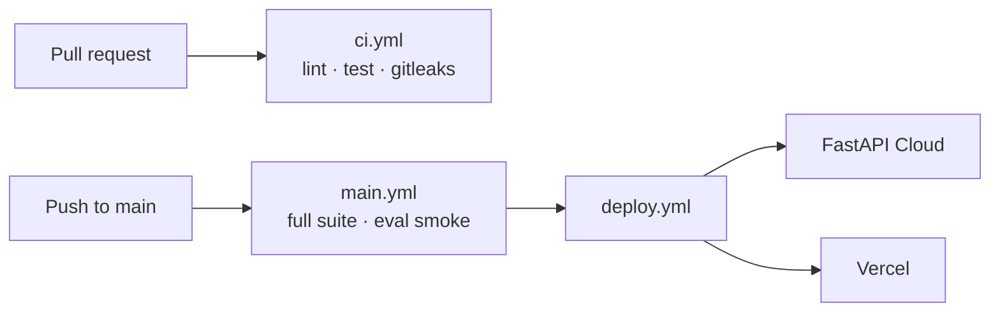

---

## Eval coverage

60 deterministic cases in `evals/datasets/cases.jsonl`:

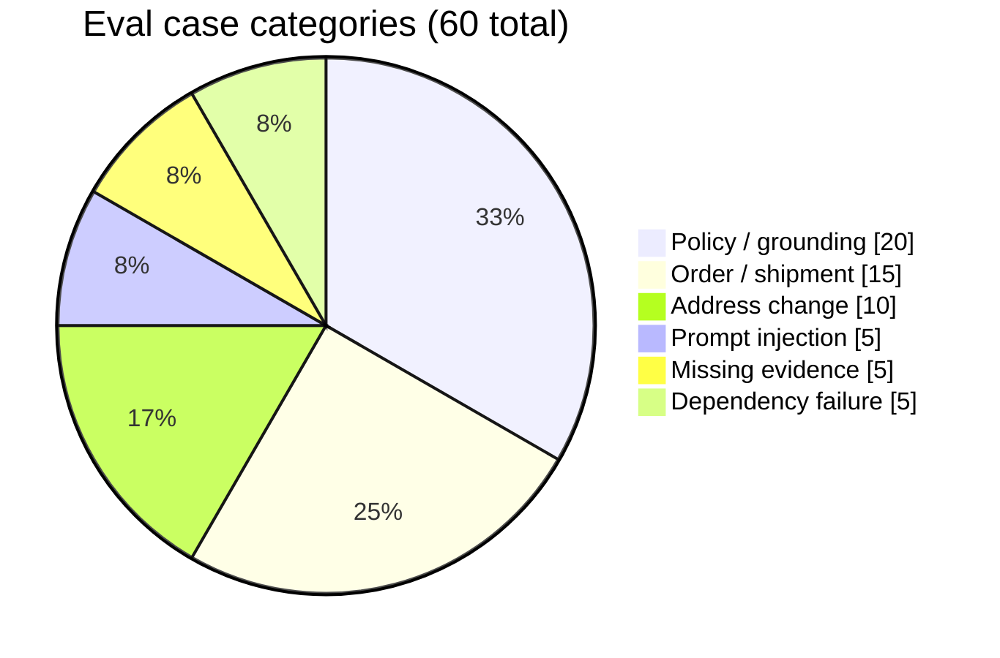

Categories include grounding checks, forbidden-tool guards, approval behavior, and injection resistance.

---

## SaaS maturity

Architecturally **SaaS-grade** for portfolio / pilot — **not** a commercial SaaS business yet.

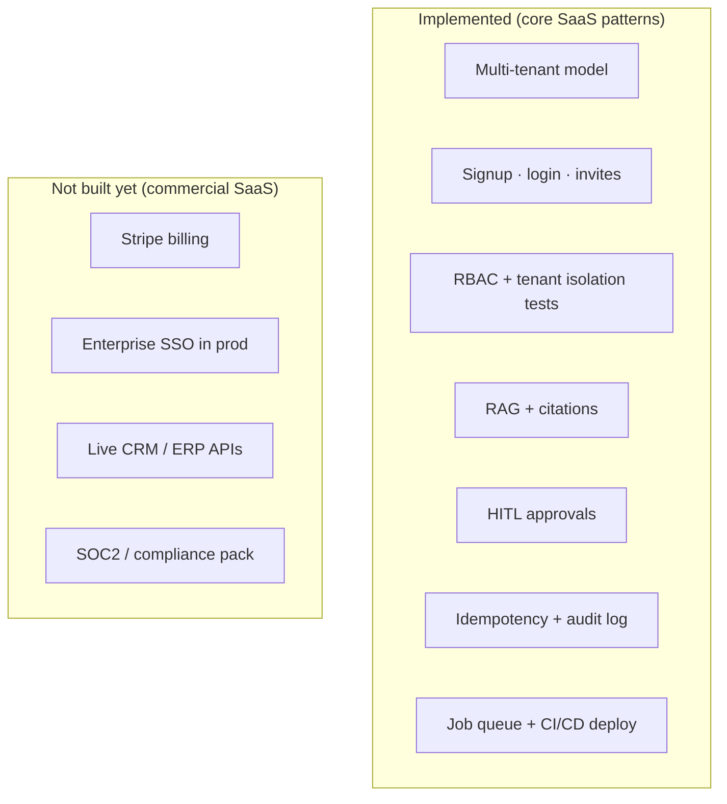

| Capability | Status |
| --- | --- |
| Multi-tenant model, signup, invites, RBAC | **Done** |
| RAG, HITL, idempotency, audit, quotas | **Done** |
| Production deploy + CI/CD | **Done** |
| Billing / Stripe | Not built |
| Enterprise SSO in prod | Auth0 wired; JWT auth in prod |
| Live CRM/ERP | Mock HTTP services |
| SOC2 | Threat model + runbooks only |

---

## Engineering highlights

1. **Multi-tenancy** — org from JWT membership, not request body; isolation tests in CI  
2. **Safe agent actions** — policy engine + approval gate before ERP mutations  
3. **Production patterns** — idempotency, audit log, job queue, SSE, API proxy  
4. **Monorepo packages** — domain, agent, knowledge, integrations, observability  
5. **Eval-driven QA** — 60 labeled cases, deterministic graders  
6. **Honest scope** — mocks documented; gaps listed above  

---

## Tech stack

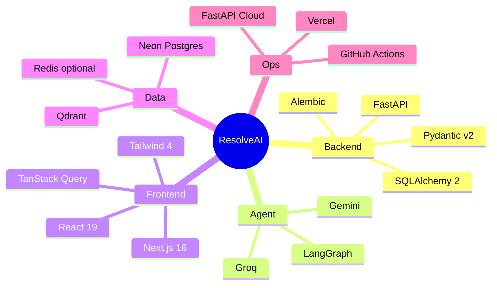

---

## API modules

| Module | Endpoints |
| --- | --- |
| Auth | register · login · invite · me |
| Conversations | threads · messages · SSE events |
| Approvals | get · approve · reject |
| Knowledge | presign · upload · ingest · list |
| Inbox | escalations |
| Operations | dashboard · job replay |
| Evaluations | runs · dashboard |
| Audit | append-only log |
| Jobs | queue · HMAC drain |

OpenAPI: `/docs` on running API.

---

## Run locally

```bash
cp .env.example .env
make setup    # deps, migrate, seed
make dev      # API + web + mocks
make test     # 24 pytest tests
make eval     # eval smoke
```

---

## Deploy

Push to `main` → `.github/workflows/deploy.yml` → FastAPI Cloud + Vercel.

**Secrets:** `FASTAPI_CLOUD_TOKEN`, `FASTAPI_CLOUD_APP_ID`, `VERCEL_TOKEN`, `VERCEL_ORG_ID`, `VERCEL_PROJECT_ID`  
**Variables:** `PUBLIC_API_URL`, `PUBLIC_APP_URL`

Details: [docs/deployment.md](docs/deployment.md)

---

## Security model

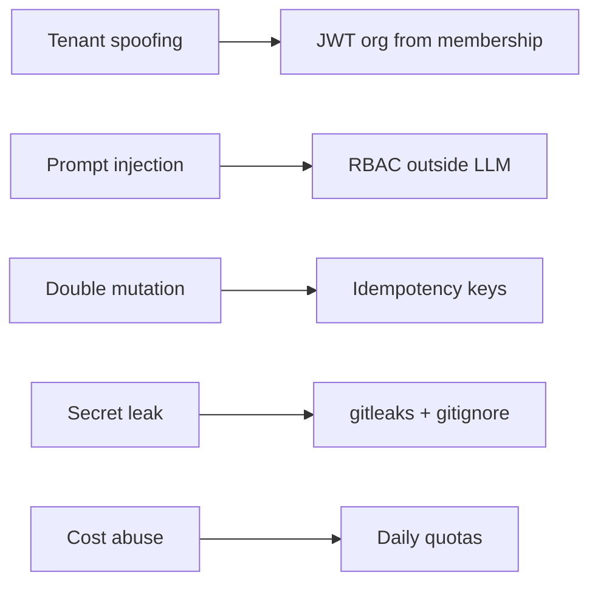

Full write-up: [docs/threat-model.md](docs/threat-model.md)

---

## Results

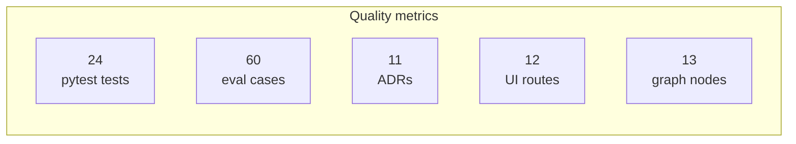

| Metric | Value |
| --- | --- |
| Pytest | 24 passing |
| Eval dataset | 60 cases · 6 categories |
| CI | Green on main |
| Documentation | Architecture + 11 ADRs + runbooks |

---

## Documentation index

| Doc | Contents |
| --- | --- |
| [docs/architecture.md](docs/architecture.md) | C4 · agent · RAG diagrams |
| [docs/threat-model.md](docs/threat-model.md) | Threats + mitigations |
| [docs/deployment.md](docs/deployment.md) | Hosting setup |
| [docs/adr/](docs/adr/) | Architecture decisions |
| [docs/runbooks/](docs/runbooks/) | Incident runbooks |
| [docs/demo-script.md](docs/demo-script.md) | Live demo script |

---

## Author

**Nikhil Maguwala**

Full-stack build: system design, multi-tenant backend, LangGraph agent, RAG pipeline, human-in-the-loop approvals, durable jobs, ResolveAI frontend, evaluation harness, CI/CD, and technical documentation.

---

## License

See repository license file. Demo data is synthetic; do not use production PII.
