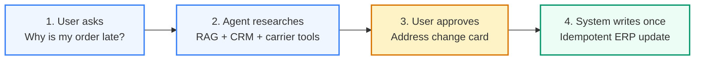
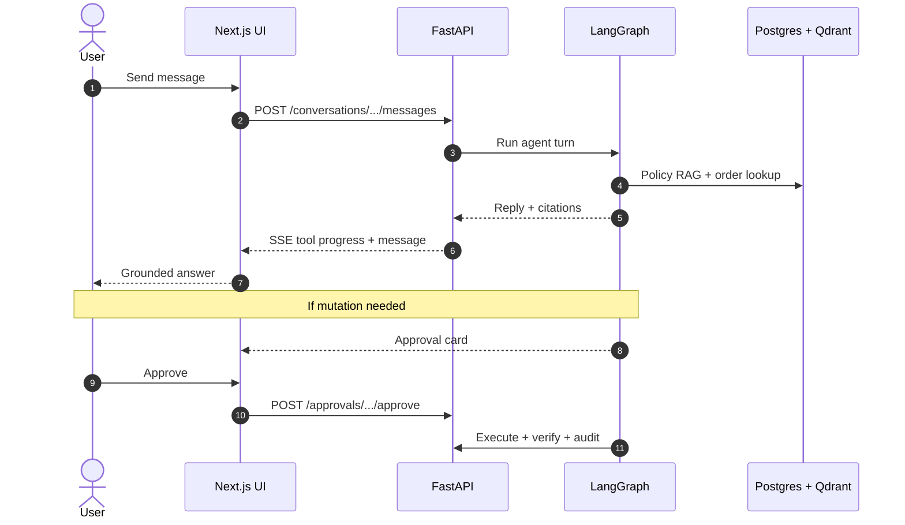
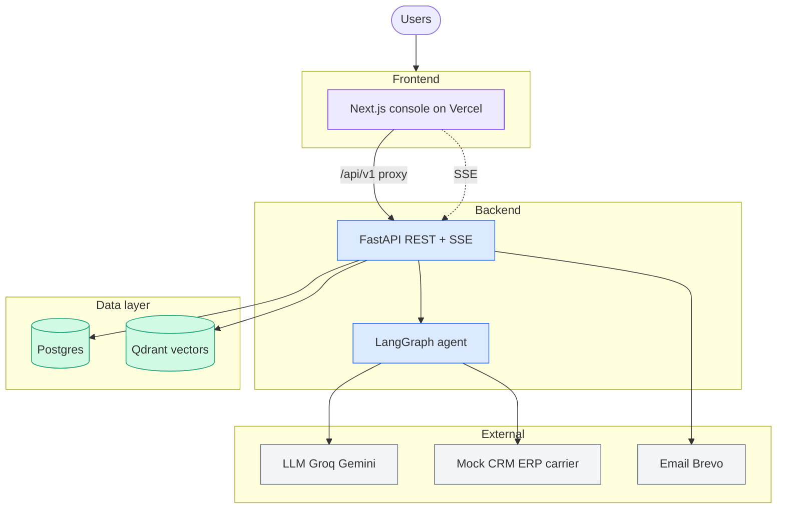
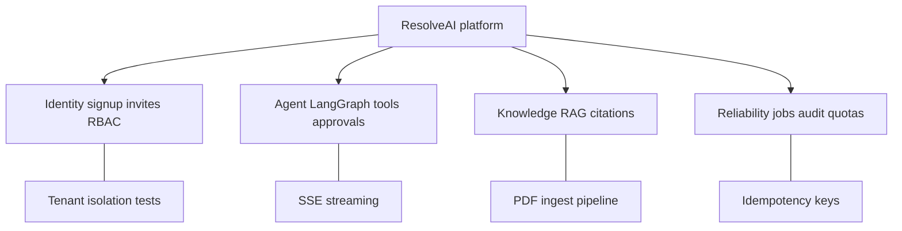
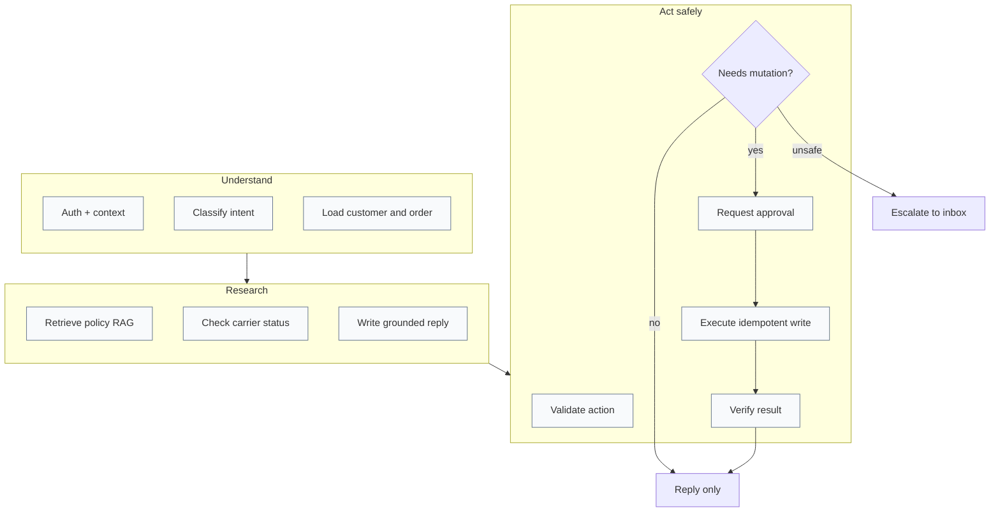
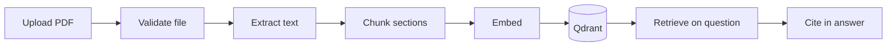
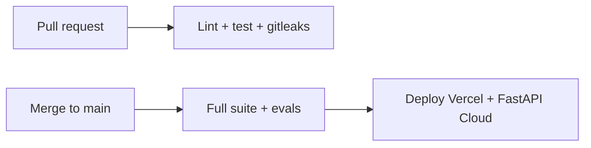
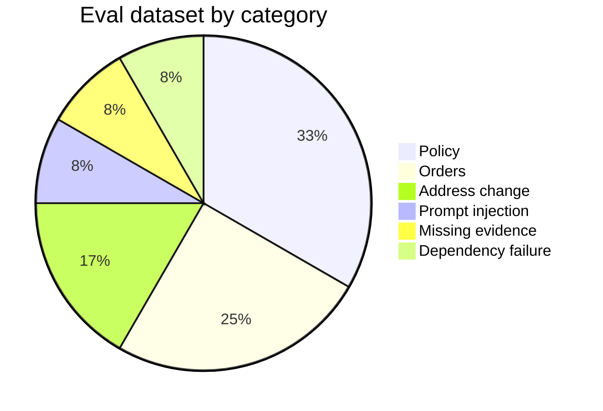

<div align="center">

# ResolveAI

**Enterprise AI support agent — multi-tenant, grounded, approval-gated**

A full-stack portfolio project: customers ask about orders, the agent pulls policy + live data,  
and **nothing mutates until a human approves it**.

<br />

[](https://www.python.org/)
[](https://fastapi.tiangolo.com/)
[](https://nextjs.org/)
[](https://langchain-ai.github.io/langgraph/)
[](#tests--quality)
[](LICENSE)

<br />

**[What it does](#what-it-does)** · **[How it works](#how-it-works)** · **[Architecture](#architecture)** · **[Features](#features)** · **[Quick start](#quick-start)** · **[Docs](#documentation)**

</div>

---

## What it does

ResolveAI is a **B2B customer-support platform** for e-commerce (demo domain: order delays and address changes).

| Stakeholder | Experience |
| --- | --- |
| **Customer** | Chats about their order; gets answers with **policy citations**, not guesses |
| **Support agent** | Handles escalations in an inbox; approves or rejects risky actions |
| **Admin** | Invites teammates, uploads knowledge docs, monitors jobs and evals |

Built and deployed end-to-end by **[Nikhil Maguwala](#author)** — backend, AI agent, frontend, CI/CD, evals, and docs.

---

## How it works

### The happy path (read this first)



### End-to-end request flow



---

## Architecture



| Layer | Location | Role |
| --- | --- | --- |
| **UI** | `apps/web` | Chat, inbox, knowledge, admin screens |
| **API** | `apps/api` | Auth, conversations, approvals, jobs |
| **Agent** | `packages/agent` | LangGraph workflow + tool calls |
| **RAG** | `packages/knowledge` | Ingest docs, search with tenant filter |
| **Integrations** | `packages/integrations` | HTTP clients for enterprise mocks |

---

## Features

### Platform capabilities



### Application screens

| Screen | Path | Who can access |
| --- | --- | --- |
| Sign up / Log in | `/signup` `/login` | Everyone |
| Conversations | `/chat` | All roles |
| Support inbox | `/inbox` | Agent, supervisor, admin |
| Knowledge base | `/knowledge` | Agent+ |
| Team invites | `/team/invite` | Admin |
| Operations | `/operations` | Admin |
| Evaluations | `/evaluations` | Supervisor+ |
| Run inspector | `/runs/[id]` | All roles |

### Role permissions

| | Chat | Inbox | Knowledge | Evals | Ops | Invite |
| ---: | :---: | :---: | :---: | :---: | :---: | :---: |
| Customer | ✓ | | | | | |
| Agent | ✓ | ✓ | ✓ | | | |
| Supervisor | ✓ | ✓ | ✓ | ✓ | | |
| Admin | ✓ | ✓ | ✓ | ✓ | ✓ | ✓ |

---

## Agent pipeline

The agent runs a **13-node LangGraph** workflow. Grouped for readability:



### Knowledge ingestion (RAG)



---

## Repository layout

```
enterprise-ai-agent/
├── apps/
│   ├── api/          ← FastAPI backend, Alembic, tests
│   └── web/          ← Next.js ResolveAI UI
├── packages/
│   ├── agent/        ← LangGraph workflow
│   ├── knowledge/    ← RAG pipeline
│   ├── integrations/ ← CRM, ERP, carrier, ticketing clients
│   ├── domain/       ← Policy engine, classifiers
│   └── observability/
├── services/         ← Local mock microservices (Docker)
├── evals/            ← 60 test cases + graders
├── docs/             ← Architecture, ADRs, runbooks
└── scripts/          ← Dev and deploy helpers
```

---

## Tech stack

| | Technologies |
| --- | --- |
| **Backend** | Python 3.12 · FastAPI · SQLAlchemy 2 · Alembic · Pydantic v2 |
| **Agent** | LangGraph · Groq · Gemini · SSE |
| **Frontend** | Next.js 16 · React 19 · TypeScript · Tailwind · TanStack Query |
| **Data** | Neon Postgres · Qdrant Cloud · optional Redis |
| **Ops** | GitHub Actions · Vercel · FastAPI Cloud · Brevo email |

---

## Quick start

```bash
git clone https://github.com/nikhilmaguwala/enterprise-ai-agent.git
cd enterprise-ai-agent
cp .env.example .env    # add Neon, Qdrant, Groq keys
make setup
make dev                # API + web + mocks
```

Open **http://localhost:3000**

| Command | What it runs |
| --- | --- |
| `make test` | 24 pytest tests |
| `make eval` | 60-case eval smoke |
| `make lint` | Python + TypeScript lint |

**Try the demo** (`DEV_AUTH_ENABLED=true`): log in as `customer@acme-demo.test`, order `ACM-10001`

**Try real signup:** `/signup` → your org + order `ORD-XXXXXX` → `/chat`

---

## Tests & quality





| Metric | Count |
| --- | ---: |
| Pytest tests | 24 |
| Eval cases | 60 |
| LangGraph nodes | 13 |
| UI routes | 12 |
| Architecture ADRs | 11 |

---

## Documentation

| Document | Description |
| --- | --- |
| [docs/architecture.md](docs/architecture.md) | System design and diagrams |
| [docs/deployment.md](docs/deployment.md) | Hosting setup guide |
| [docs/threat-model.md](docs/threat-model.md) | Security threats and mitigations |
| [docs/demo-script.md](docs/demo-script.md) | Step-by-step demo script |
| [docs/adr/](docs/adr/) | Architecture decision records |
| [docs/runbooks/](docs/runbooks/) | Operational runbooks |

---

## SaaS scope (honest)

**Implemented:** multi-tenancy, signup, invites, RBAC, RAG, approvals, idempotency, audit, quotas, CI/CD.

**Not implemented:** Stripe billing, enterprise SSO in production, live Salesforce/SAP connectors, SOC2.

---

## Public repo safety

Secrets are **not** in git (`.env` and Firebase JSON are gitignored). CI runs gitleaks.  
See [LICENSE](LICENSE) (MIT). Demo data is synthetic.

<details>
<summary>Pre-public audit checklist</summary>

| Check | Status |
| --- | --- |
| API keys in tracked files | None |
| Firebase credentials in git | Never committed |
| Tests on main | 24 passing |

Rotate Neon, Qdrant, Groq, Brevo, and Firebase credentials after open-sourcing as a precaution.

</details>

---

<div align="center">

## Author

**Nikhil Maguwala**

Full-stack: system design · multi-tenant API · LangGraph agent · RAG · HITL approvals · Next.js UI · evals · CI/CD

<br />

Portfolio project · MIT License · synthetic demo data only

</div>
