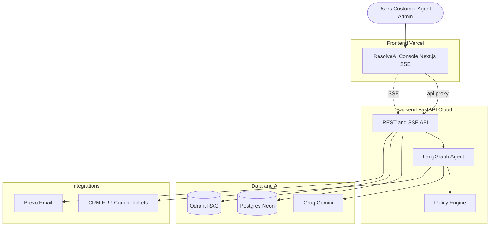
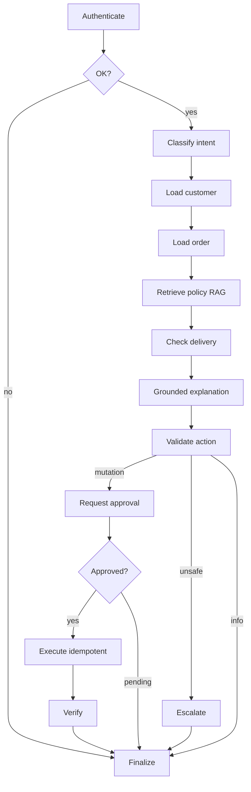
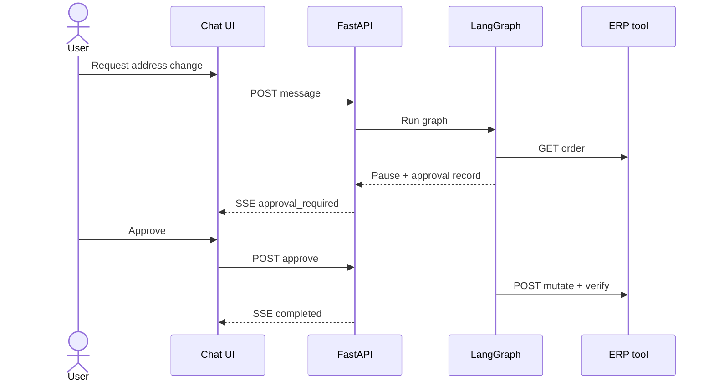
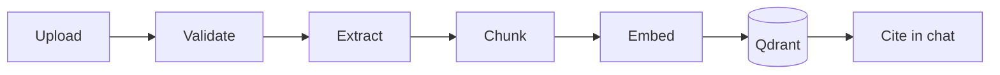
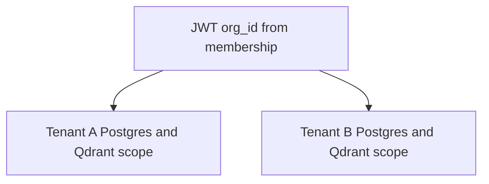
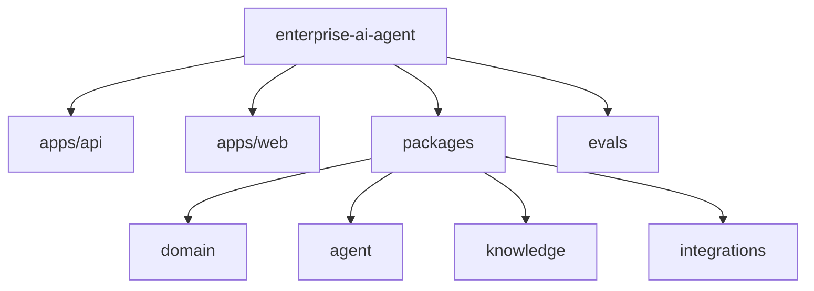
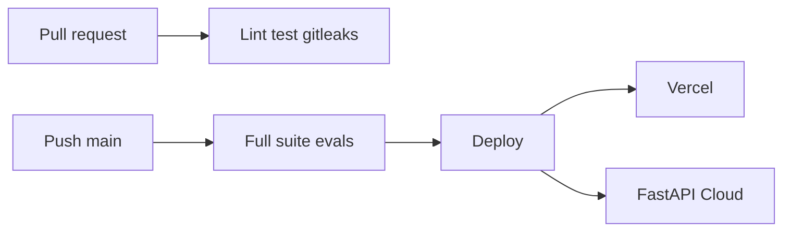
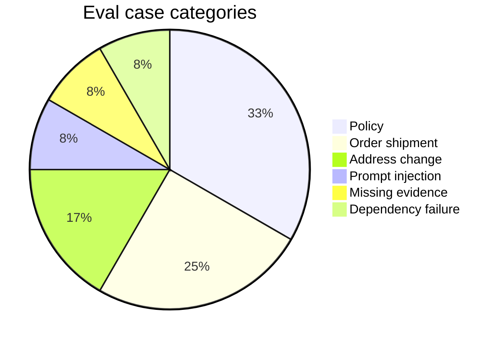
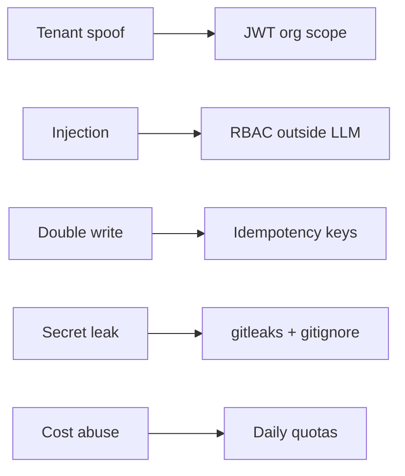

<div align="center">

# ResolveAI

### Enterprise AI Support Agent

**Multi-tenant B2B support platform · LangGraph · RAG · human-in-the-loop approvals**

<br />

[](https://www.python.org/)
[](https://fastapi.tiangolo.com/)
[](https://nextjs.org/)
[](https://langchain-ai.github.io/langgraph/)
[](.github/workflows/main.yml)

<br />

| **24** tests | **60** eval cases | **13** graph nodes | **12** UI routes | **11** ADRs |
| :---: | :---: | :---: | :---: | :---: |
| pytest + isolation | deterministic graders | LangGraph workflow | ResolveAI console | documented decisions |

<br />

[Overview](#overview) ·
[Architecture](#architecture) ·
[Features](#features) ·
[Diagrams](#diagrams) ·
[Stack](#stack) ·
[Run locally](#run-locally) ·
[Author](#author)

</div>

---

## Overview

**Portfolio project by [Nikhil Maguwala](#author)** — a full-stack enterprise AI application, not a chatbot wrapper.

I designed and built a production-deployed support agent that:

- **Grounds** answers in tenant policy (RAG + citations)
- **Calls** CRM, ERP, carrier, and ticketing tools
- **Pauses** for human approval before any mutation
- **Executes** idempotent writes with audit trail
- **Isolates** every tenant in Postgres and Qdrant

**Domain:** fictional e-commerce — order delays, address changes, escalations.

<table>
<tr>
<td width="50%" valign="top">

**Built**

- Multi-tenant backend + JWT auth
- Signup, login, team invites
- LangGraph agent (13 nodes)
- ResolveAI Next.js console
- CI/CD → Vercel + FastAPI Cloud

</td>
<td width="50%" valign="top">

**Not claimed**

- Stripe / billing
- Enterprise SSO in prod
- Live Salesforce / SAP
- SOC2 certification

</td>
</tr>
</table>

---

## Architecture

One-page view of the system:



---

## Features

<table>
<tr>
<th>Area</th>
<th>What it does</th>
</tr>
<tr>
<td><b>Auth & tenancy</b></td>
<td>Signup creates org + admin + starter order · team invites · RBAC · tenant isolation tests</td>
</tr>
<tr>
<td><b>Chat</b></td>
<td>Streaming SSE · tool progress · policy citations · approval cards in UI</td>
</tr>
<tr>
<td><b>Agent</b></td>
<td>13-node LangGraph · classify → RAG → tools → validate → approve → mutate → verify</td>
</tr>
<tr>
<td><b>Knowledge</b></td>
<td>PDF upload · chunk · embed · Qdrant search with mandatory <code>organization_id</code> filter</td>
</tr>
<tr>
<td><b>Ops</b></td>
<td>Job queue · dead-letter replay · audit log · quotas · eval dashboard</td>
</tr>
</table>

### UI routes

| Route | Who | Purpose |
| --- | --- | --- |
| `/signup` · `/login` | Public | Register workspace |
| `/chat` | All | Conversations + approvals |
| `/inbox` | Agent+ | Escalation queue |
| `/knowledge` | Agent+ | Document upload |
| `/team/invite` | Admin | Invite teammates |
| `/operations` | Admin | Job health |
| `/evaluations` | Supervisor+ | Eval runs |
| `/runs/[id]` | All | Agent inspector |

---

## Diagrams

<details open>
<summary><b>Agent workflow — 13 LangGraph nodes</b></summary>

<br />



</details>

<details>
<summary><b>Approval sequence — human-in-the-loop before ERP write</b></summary>

<br />



</details>

<details>
<summary><b>RAG pipeline — upload to citation</b></summary>

<br />



</details>

<details>
<summary><b>Multi-tenancy — JWT org context, never trust client body</b></summary>

<br />



Tenant A **cannot** read Tenant B — enforced in API queries, RAG filters, and CI isolation tests.

| Role | Chat | Inbox | Knowledge | Evals | Ops | Invite |
| --- | :---: | :---: | :---: | :---: | :---: | :---: |
| Customer | ✓ | | | | | |
| Agent | ✓ | ✓ | ✓ | | | |
| Supervisor | ✓ | ✓ | ✓ | ✓ | | |
| Admin | ✓ | ✓ | ✓ | ✓ | ✓ | ✓ |

</details>

<details>
<summary><b>Monorepo structure</b></summary>

<br />



</details>

<details>
<summary><b>CI/CD — test on PR, deploy on main</b></summary>

<br />



</details>

<details>
<summary><b>Eval dataset — 60 cases</b></summary>

<br />



</details>

<details>
<summary><b>Security model</b></summary>

<br />



→ [docs/threat-model.md](docs/threat-model.md)

</details>

More diagrams: [docs/architecture.md](docs/architecture.md)

---

## Stack

<div align="center">

| Backend | Agent | Frontend | Data | Hosting |
| :---: | :---: | :---: | :---: | :---: |
| FastAPI | LangGraph | Next.js 16 | Neon Postgres | Vercel |
| SQLAlchemy 2 | Groq | React 19 | Qdrant | FastAPI Cloud |
| Alembic | Gemini | TanStack Query | Redis optional | GitHub Actions |
| Pydantic v2 | Tool gateway | Tailwind 4 | R2 / Firebase | Brevo email |

</div>

---

## Run locally

```bash
git clone https://github.com/nikhilmaguwala/enterprise-ai-agent.git
cd enterprise-ai-agent
cp .env.example .env          # add Neon, Qdrant, Groq keys
make setup && make dev
```

| Command | Action |
| --- | --- |
| `make test` | 24 pytest tests |
| `make eval` | 60-case eval smoke |
| `make lint` | ruff + ESLint |

**Demo login** (`DEV_AUTH_ENABLED=true`): `customer@acme-demo.test` · order `ACM-10001`

**Real flow:** `/signup` → org + order `ORD-XXXXXX` → `/chat`

---

## Deploy

Every push to `main` runs [deploy.yml](.github/workflows/deploy.yml) → **Vercel** + **FastAPI Cloud**.

Set GitHub **secrets** (`FASTAPI_CLOUD_*`, `VERCEL_*`) and **variables** (`PUBLIC_API_URL`, `PUBLIC_APP_URL`).

→ [docs/deployment.md](docs/deployment.md)

---

## Documentation

| Doc | Contents |
| --- | --- |
| [architecture.md](docs/architecture.md) | C4 · workflows · RAG |
| [threat-model.md](docs/threat-model.md) | Security analysis |
| [deployment.md](docs/deployment.md) | Hosting guide |
| [adr/](docs/adr/) | 11 architecture decisions |
| [runbooks/](docs/runbooks/) | Incident runbooks |
| [demo-script.md](docs/demo-script.md) | Live demo walkthrough |

---

## Public repository checklist

Audited before open-sourcing. **Current `main` is safe to publish.**

| Check | Status |
| --- | --- |
| API keys / passwords in tracked files | **None found** |
| Firebase JSON in git | **Never committed** |
| `.env` gitignored | **Yes** |
| gitleaks in CI | **Yes** (`ci.yml`) |
| Tests on main | **24 passing** |
| Personal infra IDs scrubbed from source | **Yes** |
| Deploy secrets in GitHub Secrets only | **Yes** |

**Gitignored locally (will NOT go public unless you force-add):**

- `.env`, `.env.local`, `*firebase-adminsdk*.json`, `infra/secrets/`

**Rotate after going public (precaution):**

Neon DB password, Qdrant key, Groq key, Brevo key, Vercel/FastAPI tokens, Firebase service account, `DEV_AUTH_SECRET`, `INTERNAL_JOB_*`.

**Old git history note:** earlier commits briefly contained a Firebase **project bucket name** and FastAPI **app id** (not private keys). If that concerns you, rotate Firebase credentials and create a new FastAPI Cloud app id.

Demo data is synthetic. Do not put real customer PII in this project.

---

**Nikhil Maguwala**

System design · multi-tenant backend · LangGraph agent · RAG · HITL approvals · ResolveAI UI · evals · CI/CD

<br />

*Portfolio project — synthetic demo data only · [MIT License](LICENSE)*

</div>
