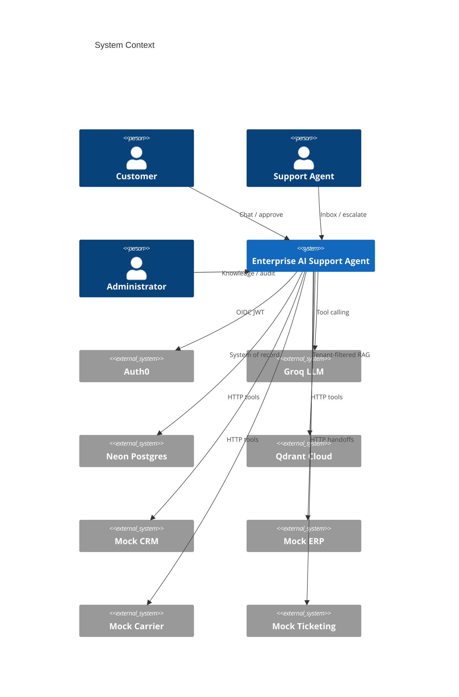
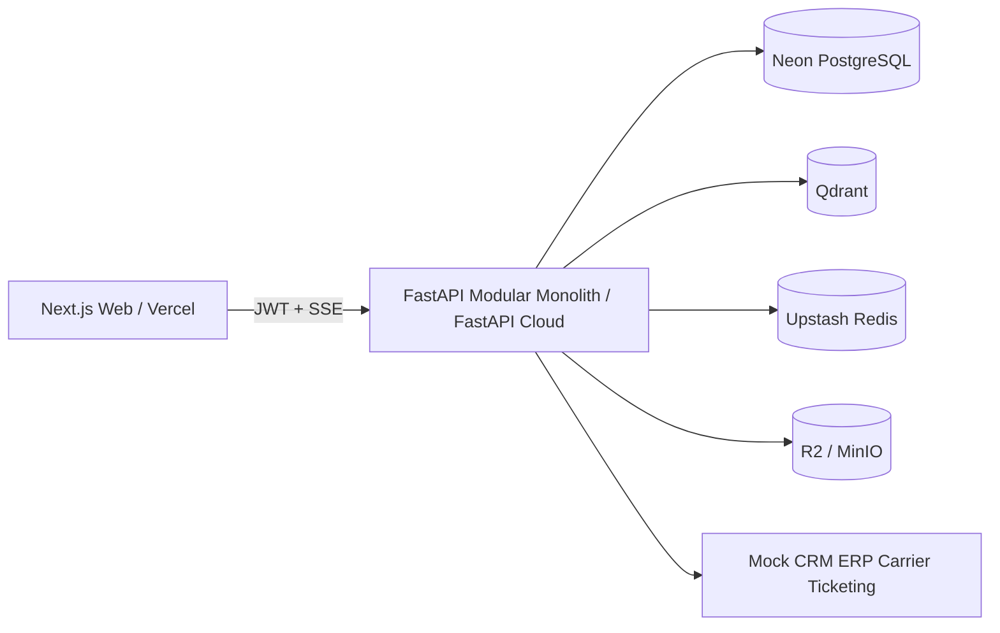
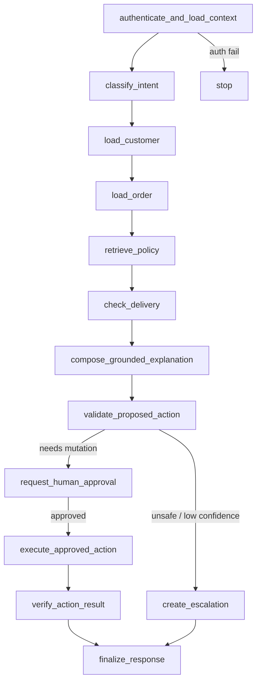
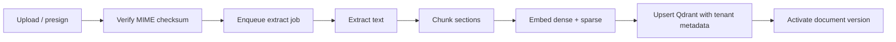
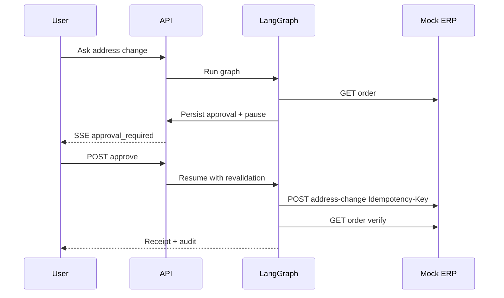
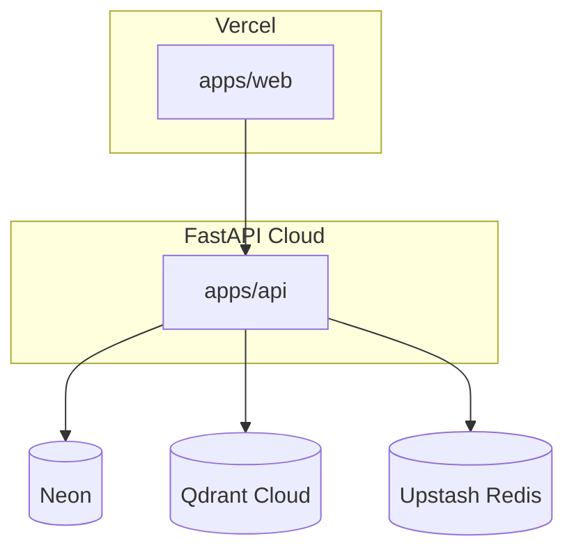

# Architecture — Enterprise AI Support Agent

## Product context

A multi-tenant AI support agent for a fictional e-commerce company. Primary demo: explain an order delay with grounded citations, then propose an address change that requires explicit human approval, single-execution idempotent mutation, verification, and full audit trail.

## System context

## Containers

## Modular monolith modules

| Module | Responsibility |
| --- | --- |
| Identity & tenancy | OIDC validation, memberships, RBAC, trusted tenant context |
| Conversations | Threads, messages, SSE event persistence |
| Agent orchestration | LangGraph workflow, pauses for approval |
| Knowledge | Ingestion, chunking, embeddings, hybrid retrieval |
| Integrations | Typed tool gateway to mock enterprise APIs |
| Approvals | Deterministic validation, hash, pause/resume |
| Jobs | Postgres durable queue + transactional outbox |
| Audit | Immutable audit events |
| Evaluations | Datasets, graders, dashboards |
| Observability | structlog, OTEL hooks, Langfuse (optional) |

## Agent workflow

## RAG ingestion

## Approval sequence

## Deployment topology (demo)

## Key invariants

1. Authorization is deterministic backend code — never LLM-decided.
2. PostgreSQL is the system of record for business state, jobs, approvals, audit.
3. Every Qdrant search filters by `organization_id`.
4. Mutations require validation + approval + idempotency + verify-read.
5. Optional deps (Redis, Langfuse) degrade safely.
